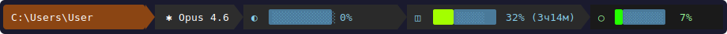

# MorgottStatusLine

Кастомный statusline для Claude Code с отслеживанием лимитов подписки Max/Pro.

Форк [claude-limitline](https://github.com/tylergraydev/claude-limitline) с доработками:

- **Цветные прогрессбары** — заполненность плавно меняется от зелёного к красному, пустая часть голубая
- **Русская локализация** — время `3ч17м`, `6д18ч`, подписи `нед`, `БЛК`, `КТК`
- **Полный путь** к рабочей директории
- **Время до сброса** на всех лимитах (5ч блок + неделя)
- **Контекст в основном потоке** с прогрессбаром
- **Кроссплатформенный** — Windows, macOS, Linux

## Как выглядит



| Сегмент | Описание |
|---------|----------|
| Путь | Полный путь к рабочей директории |
| Модель | Текущая модель Claude |
| ◐ Контекст | Использование контекстного окна |
| ◫ Блок 5ч | Лимит 5-часового блока подписки |
| ○ Неделя | Недельный лимит подписки |

## Установка

### npm (рекомендуется)

```bash
npm install -g morgott-statusline
```

### Из исходников

```bash
git clone https://github.com/UberMorgott/MorgottStatusLine.git
cd MorgottStatusLine
npm link
```

## Настройка Claude Code

Добавить в `~/.claude/settings.json`:

```json
{
  "statusLine": {
    "type": "command",
    "command": "npx morgott-statusline"
  }
}
```

Или если установлен глобально:

```json
{
  "statusLine": {
    "type": "command",
    "command": "morgott-statusline"
  }
}
```

## Конфигурация

Создать `~/.claude/claude-limitline.json`:

```json
{
  "display": {
    "style": "powerline",
    "useNerdFonts": true,
    "compactMode": "never"
  },
  "directory": { "enabled": true },
  "git": { "enabled": false },
  "model": { "enabled": true },
  "block": {
    "enabled": true,
    "displayStyle": "bar",
    "barWidth": 8,
    "showTimeRemaining": true
  },
  "weekly": {
    "enabled": true,
    "displayStyle": "bar",
    "barWidth": 8,
    "showWeekProgress": true,
    "viewMode": "smart"
  },
  "context": { "enabled": true },
  "budget": {
    "pollInterval": 15,
    "warningThreshold": 80
  },
  "theme": "dark",
  "segmentOrder": ["directory", "model", "context", "block", "weekly"],
  "showTrend": true
}
```

### Параметры

| Параметр | Описание | По умолчанию |
|----------|----------|-------------|
| `display.useNerdFonts` | Символы Nerd Font для powerline | `true` |
| `display.compactMode` | `"auto"`, `"always"`, `"never"` | `"auto"` |
| `directory.enabled` | Полный путь к директории | `true` |
| `git.enabled` | Git-ветка с индикатором изменений | `true` |
| `model.enabled` | Модель Claude | `true` |
| `block.displayStyle` | `"bar"` или `"text"` | `"text"` |
| `block.barWidth` | Ширина прогрессбара (символы) | `10` |
| `block.showTimeRemaining` | Время до сброса блока | `true` |
| `weekly.displayStyle` | `"bar"` или `"text"` | `"text"` |
| `weekly.viewMode` | `"simple"` или `"smart"` | `"simple"` |
| `budget.pollInterval` | Минут между запросами к API | `15` |
| `budget.warningThreshold` | % для перехода в предупреждение | `80` |
| `theme` | Тема оформления | `"dark"` |
| `segmentOrder` | Порядок сегментов | см. выше |
| `showTrend` | Стрелки ↑↓ изменения расхода | `true` |

### Темы

`dark`, `light`, `nord`, `gruvbox`, `tokyo-night`, `rose-pine`

### Порядок сегментов

Любой порядок из: `directory`, `model`, `context`, `block`, `weekly`, `git`

## OAuth-токен

Токен берётся автоматически из хранилища Claude Code:

| Платформа | Расположение |
|-----------|-------------|
| **macOS** | Keychain (`Claude Code-credentials`) |
| **Windows** | Credential Manager или `~/.claude/.credentials.json` |
| **Linux** | GNOME Keyring (secret-tool) или `~/.claude/.credentials.json` |

Нужна авторизация через `claude --login`.

## Отладка

```bash
# Linux/macOS
CLAUDE_LIMITLINE_DEBUG=true morgott-statusline

# Windows PowerShell
$env:CLAUDE_LIMITLINE_DEBUG="true"; morgott-statusline
```

## Лицензия

MIT — основано на [claude-limitline](https://github.com/tylergraydev/claude-limitline) by Tyler Gray
