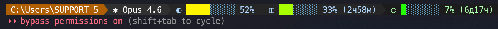

# MorgottStatusLine

Кастомный statusline для Claude Code с отслеживанием лимитов подписки Max/Pro.

Форк [claude-limitline](https://github.com/tylergraydev/claude-limitline) с доработками:

- **Shared disk cache** — все окна Claude Code используют один кэш, без дублирования API-запросов
- **File lock** — атомарная блокировка (`O_EXCL`) предотвращает race condition между окнами
- **Trend persistence** — стрелки ↑↓ работают между перезапусками (хранятся на диске)
- **Credentials file first** — мгновенное чтение токена из файла, shell-команды только как fallback
- **macOS Keychain hash-suffix** — поддержка нового формата `Claude Code-credentials-<hash>`
- **Цветные прогрессбары** — плавный градиент от зелёного к красному
- **Русская локализация** — время `3ч17м`, `6д18ч`
- **Кроссплатформенный** — Windows, macOS, Linux

## Как выглядит



| Сегмент | Описание |
|---------|----------|
| Путь | Рабочая директория |
| Модель | Текущая модель Claude (Opus 4.6, Sonnet 4.6, и т.д.) |
| 🧠 Контекст | Использование контекстного окна |
| ⏱️ Блок 5ч | Лимит 5-часового блока подписки + время до сброса |
| 📅 Неделя | Недельный лимит подписки + время до сброса |

## Установка (одна команда)

**Windows (PowerShell):**
```powershell
irm https://raw.githubusercontent.com/UberMorgott/MorgottStatusLine/master/install.ps1 | iex
```

**macOS / Linux:**
```bash
curl -fsSL https://raw.githubusercontent.com/UberMorgott/MorgottStatusLine/master/install.sh | bash
```

Скрипт автоматически:
1. Установит пакет с GitHub
2. Создаст конфиг `~/.claude/claude-limitline.json`
3. Настроит `~/.claude/settings.json`
4. Перезапустите Claude Code — готово

> Требуется [Node.js](https://nodejs.org) >= 18 и авторизация через `claude --login`

## Конфигурация

Файл `~/.claude/claude-limitline.json`:

```json
{
  "display": {
    "style": "powerline",
    "useNerdFonts": true,
    "compactMode": "never"
  },
  "directory": { "enabled": true },
  "git": { "enabled": false },
  "model": { "enabled": true },
  "block": {
    "enabled": true,
    "displayStyle": "bar",
    "barWidth": 8,
    "showTimeRemaining": true
  },
  "weekly": {
    "enabled": true,
    "displayStyle": "bar",
    "barWidth": 8,
    "showWeekProgress": true,
    "viewMode": "smart"
  },
  "context": { "enabled": true },
  "budget": {
    "pollInterval": 5,
    "warningThreshold": 80
  },
  "theme": "dark",
  "segmentOrder": ["directory", "model", "context", "block", "weekly"],
  "showTrend": true
}
```

### Параметры

| Параметр | Описание | По умолчанию |
|----------|----------|-------------|
| `display.useNerdFonts` | Символы Nerd Font для powerline | `true` |
| `display.compactMode` | `"auto"`, `"always"`, `"never"` | `"auto"` |
| `directory.enabled` | Путь к директории | `true` |
| `git.enabled` | Git-ветка с индикатором изменений | `true` |
| `model.enabled` | Модель Claude | `true` |
| `block.displayStyle` | `"bar"` или `"text"` | `"text"` |
| `block.barWidth` | Ширина прогрессбара (символы) | `10` |
| `block.showTimeRemaining` | Время до сброса блока | `true` |
| `weekly.displayStyle` | `"bar"` или `"text"` | `"text"` |
| `weekly.viewMode` | `"simple"` или `"smart"` | `"simple"` |
| `budget.pollInterval` | Минут между запросами к API | `15` |
| `budget.warningThreshold` | % для перехода в предупреждение | `80` |
| `theme` | Тема оформления | `"dark"` |
| `segmentOrder` | Порядок сегментов | см. выше |
| `showTrend` | Стрелки ↑↓ изменения расхода | `true` |

### Темы

`dark`, `light`, `nord`, `gruvbox`, `tokyo-night`, `rose-pine`

### Порядок сегментов

Любой порядок из: `directory`, `model`, `context`, `block`, `weekly`, `git`

## OAuth-токен

Токен берётся автоматически — сначала из файла (мгновенно), затем из системного хранилища:

| Платформа | Приоритет |
|-----------|-----------|
| **Windows** | `~/.claude/.credentials.json` → Credential Manager (PowerShell) |
| **macOS** | `~/.claude/.credentials.json` → Keychain (поддержка hash-суффиксов) |
| **Linux** | `~/.claude/.credentials.json` → GNOME Keyring (secret-tool) |

Нужна авторизация через `claude --login`.

## Отладка

```bash
# Linux/macOS
CLAUDE_LIMITLINE_DEBUG=true morgott-statusline

# Windows PowerShell
$env:CLAUDE_LIMITLINE_DEBUG="true"; morgott-statusline
```

## Лицензия

MIT — основано на [claude-limitline](https://github.com/tylergraydev/claude-limitline) by Tyler Gray
