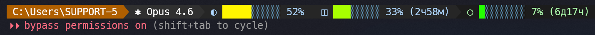

# MorgottStatusLine

Строка состояния для Claude Code: рабочая директория, модель, заполнение контекста и лимиты подписки за 5 часов и неделю. Время отображается по-русски.



## Установка

Требуются Node.js **18 или новее** и npm.

**Windows — PowerShell:**

```powershell
irm https://raw.githubusercontent.com/UberMorgott/MorgottStatusLine/master/install.ps1 | iex
```

**macOS / Linux — Bash:**

```bash
curl -fsSL https://raw.githubusercontent.com/UberMorgott/MorgottStatusLine/master/install.sh | bash
```

Из клонированного репозитория то же самое: `.\install.ps1` или `bash install.sh`.

Скрипты устанавливают пакет с GitHub, создают `~/.claude/claude-limitline.json`, если его ещё нет, и задают `statusLine` в `~/.claude/settings.json`, заменяя предыдущую настройку строки состояния. В Windows скрипт использует `%USERPROFILE%\.claude`.

В macOS / Linux пакет устанавливается в `$HOME/.local`. Добавьте каталог исполняемых файлов в `PATH`, если его там нет:

```bash
export PATH="$HOME/.local/bin:$PATH"
```

Сохраните эту строку в конфигурации вашей оболочки, чтобы настройка действовала после её перезапуска.

Если во время установки каталог с командой не найден в `PATH`, скрипт записывает в `statusLine` абсолютный путь: `install.sh` — путь к `~/.local/bin/morgott-statusline`, `install.ps1` — `node "<глобальный node_modules>/morgott-statusline/dist/index.js"`.

**Установка локальной копии без скриптов:**

```bash
npm i -g .
```

В этом случае настройте Claude Code вручную: добавьте следующий ключ в существующий `~/.claude/settings.json`, сохранив остальные настройки.

```json
{
  "statusLine": {
    "type": "command",
    "command": "morgott-statusline"
  }
}
```

Команда `morgott-statusline` должна быть доступна через `PATH` процесса Claude Code. После установки перезапустите Claude Code.

## Настройки

Общий файл настроек: `~/.claude/claude-limitline.json`. Для отдельного проекта можно создать `.claude-limitline.json` в рабочем каталоге процесса. Первый успешно прочитанный файл имеет приоритет; два файла не объединяются. Неуказанные параметры берутся из встроенных значений.

Минимальный пример с прогрессбарами:

```json
{
  "git": { "enabled": false },
  "block": { "displayStyle": "bar" },
  "weekly": { "displayStyle": "bar", "viewMode": "smart" },
  "segmentOrder": ["directory", "model", "context", "block", "weekly"]
}
```

Ниже приведены **встроенные значения**, действующие без пользовательских настроек. Установщики создают другой вариант: Git выключен, компактный режим — `never`, лимиты показаны полосами, недельный режим — `smart`, интервал API — 5 минут. В [config-example.json](config-example.json) интервал равен 15 минутам.

| Параметр | Назначение | Встроенное значение |
|---|---|---|
| `display.useNerdFonts` | Powerline-разделители и символы Nerd Font; `false` включает упрощённое оформление | `true` |
| `display.compactMode` | `auto`, `always` или `never`; при переполнении строка всё равно сокращается | `auto` |
| `display.compactWidth` | Порог ширины терминала для режима `auto`, в колонках | `80` |
| `display.rightReserve` | Дополнительное место справа, в колонках | `1` |
| `directory.enabled`, `git.enabled`, `model.enabled`, `context.enabled` | Включить путь, Git-ветку и индикатор изменений, модель или контекст | Все `true` |
| `block.enabled`, `weekly.enabled` | Включить лимит за 5 часов или неделю | Оба `true` |
| `block.displayStyle`, `weekly.displayStyle` | `text` или `bar`; в недельном режиме `smart` используется полоса | Оба `text` |
| `block.showTimeRemaining` | Время до сброса 5-часового лимита вне компактного режима | `true` |
| `weekly.viewMode` | `simple` — общий лимит; `smart` — также отдельный лимит Sonnet, если он доступен и выбрана модель Sonnet | `simple` |
| `weekly.showWeekProgress` | Доля прошедшей недели в режиме `simple` вне компактного режима | `true` |
| `budget.pollInterval` | Интервал обновления API-кэша, в минутах; данные из Claude Code могут использоваться без запроса API | `15` |
| `budget.warningThreshold` | Порог предупреждения для контекста и лимитов, в процентах | `80` |
| `theme` | Цветовая тема | `dark` |
| `segmentOrder` | Набор сегментов и порядок внутри групп оформления | `["directory", "git", "model", "context", "block", "weekly"]` |
| `showTrend` | Стрелки изменения расхода ↑↓ | `true` |

Темы: `dark`, `light`, `nord`, `gruvbox`, `tokyo-night`, `rose-pine`.

Ширина полос подбирается автоматически по ширине терминала. Параметры `block.barWidth` и `weekly.barWidth` из примера не задают фиксированную ширину текущего оформления.

### Дополнительные сегменты

Чтобы показать сегмент, добавьте его имя в `segmentOrder`. Следующие сегменты отсутствуют в стандартном наборе и по умолчанию относятся ко второй строке:

| Имя | Что показывает |
|---|---|
| `prognosis` | Прогноз времени до 100% 5-часового лимита и историю расхода |
| `cost` | Стоимость сессии в USD и число изменённых строк; скрыт при наличии данных о лимитах подписки, если не задано `cost.alwaysShow: true` |
| `mode` | Уровень усилий и режим размышления, если Claude Code передал их |
| `tokenBreakdown` | Приблизительное распределение токенов по содержимому транскрипта и инструментам |
| `aggregate` | Число активных сессий, суммарную стоимость и контекст |

Для любого сегмента `<имя>.enabled` включает показ (по умолчанию `true`), а `<имя>.line` выбирает строку: `1` для основных сегментов, `2` для дополнительных. `line2.enabled` (по умолчанию `true`) управляет показом второй строки.

### Переменные окружения

| Переменная | Назначение |
|---|---|
| `CLAUDE_LIMITLINE_DEBUG` | Значение `true` включает диагностический вывод в stderr; по умолчанию выключено |
| `COLUMNS` | Ширина строки в колонках; без неё используются ширина stdout или 80 колонок |
| `CLAUDE_MODEL`, `CLAUDE_CODE_MODEL`, `ANTHROPIC_MODEL` | Резервное имя модели, если её нет во входных данных; проверяются в указанном порядке |

Данные о модели, контексте и лимитах поступают от Claude Code. Для запросов к API программа ищет OAuth-учётные данные сначала в файлах, затем в системном хранилище. Если сведения о лимитах недоступны, вместо процентов отображается `--`.

## Обновление

Повторно запустите `install.ps1` или `install.sh`: пакет будет переустановлен с GitHub, существующий `claude-limitline.json` сохранится, настройка `statusLine` будет задана заново.

Для локальной установки обновите копию репозитория и повторите:

```bash
npm i -g .
```

Перезапустите Claude Code.

## Удаление

Удалите ключ `statusLine` из `~/.claude/settings.json` или замените его настройкой другой строки состояния, сохранив остальные ключи.

Для Windows и локальной установки через `npm i -g .`:

```bash
npm uninstall -g morgott-statusline
```

Для установки через `install.sh`:

```bash
npm uninstall -g --prefix "$HOME/.local" morgott-statusline
```

При необходимости отдельно удалите свои файлы `claude-limitline.json` и `.claude-limitline.json`. Перезапустите Claude Code.

## Лицензия

[MIT](LICENSE). Основано на [claude-limitline](https://github.com/tylergraydev/claude-limitline) (Tyler Gray).